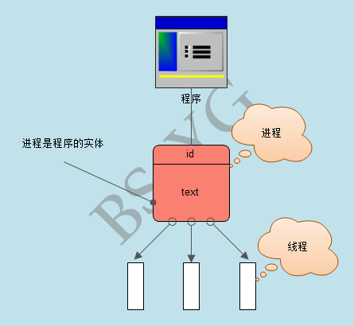

进程是计算机中的程序关于某数据集合上的一次运行活动，是系统进行资源分配和调度的基本单位，是操作系统结构的基础。或者说进程是具有一定独立功能的程序关于某个数据集合上的一次运行活动,进程是系统进行资源分配和调度的一个独立单位。

线程则是进程的一个实体,是CPU调度和分派的基本单位,它是比进程更小的能独立运行的基本单位。

进程和线程的关系：
(1)一个线程只能属于一个进程，而一个进程可以有多个线程，但至少有一个线程。
(2)资源分配给进程，同一进程的所有线程共享该进程的所有资源。
(3)CPU分给线程，即真正在CPU上运行的是线程。