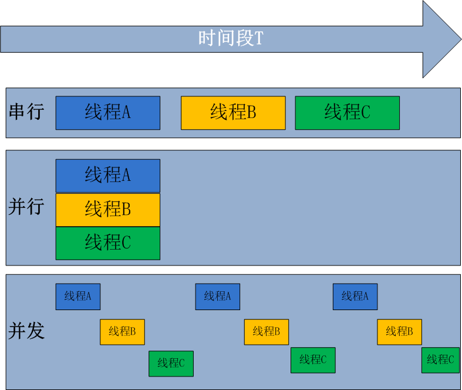

并行处理（Parallel Processing）是计算机系统中能同时执行两个或更多个处理的一种计算方法。并行处理可同时工作于同一程序的不同方面。并行处理的主要目的是节省大型和复杂问题的解决时间。并发处理(concurrency Processing)：指一个时间段中有几个程序都处于已启动运行到运行完毕之间，且这几个程序都是在同一个处理机(CPU)上运行，但任一个时刻点上只有一个程序在处理机(CPU)上运行

并发的关键是你有处理多个任务的能力，不一定要同时。并行的关键是你有同时处理多个任务的能力。所以说，并行是并发的子集

