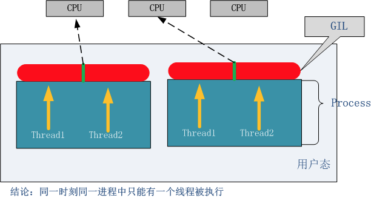

Python中的线程是操作系统的原生线程，Python虚拟机使用一个全局解释器锁（Global Interpreter Lock）来互斥线程对Python虚拟机的使用。为了支持多线程机制，一个基本的要求就是需要实现不同线程对共享资源访问的互斥，所以引入了GIL。

GIL：在一个线程拥有了解释器的访问权之后，其他的所有线程都必须等待它释放解释器的访问权，即使这些线程的下一条指令并不会互相影响。

在调用任何Python C API之前，要先获得GIL

GIL缺点：多处理器退化为单处理器；优点：避免大量的加锁解锁操作

---

### GIL的早期设计
Python支持多线程，而解决多线程之间数据完整性和状态同步的最简单方法自然就是加锁。 于是有了GIL这把超级大锁，而当越来越多的代码库开发者接受了这种设定后，他们开始大量依赖这种特性（即默认python内部对象是thread-safe的，无需在实现时考虑额外的内存锁和同步操作）。慢慢的这种实现方式被发现是蛋疼且低效的。但当大家试图去拆分和去除GIL的时候，发现大量库代码开发者已经重度依赖GIL而非常难以去除了。有多难？做个类比，像MySQL这样的“小项目”为了把Buffer Pool Mutex这把大锁拆分成各个小锁也花了从5.5到5.6再到5.7多个大版为期近5年的时间，并且仍在继续。MySQL这个背后有公司支持且有固定开发团队的产品走的如此艰难，那又更何况Python这样核心开发和代码贡献者高度社区化的团队呢？

---

### GIL的影响
无论你启多少个线程，你有多少个cpu, Python在执行一个进程的时候会淡定的在同一时刻只允许一个线程运行。
所以，python是无法利用多核CPU实现多线程的。

这样，python对于计算密集型的任务开多线程的效率甚至不如串行(没有大量切换)，但是，对于IO密集型的任务效率还是有显著提升的。



### 计算密集型
```python
from threading import Thread
import time


def counter():
    i = 0
    for _ in range(50000000):
        i = i + 1

    return True


def main():

    l = []
    start_time = time.time()

    for i in range(2):

        t = Thread(target=counter)
        t.start()
        l.append(t)
        t.join()

    # for t in l:
    #     t.join()

    end_time = time.time()
    print("Total time: {}".format(end_time - start_time))


if __name__ == '__main__':
    main()


'''
py2.7:
     串行:25.4523348808s
     并发:31.4084379673s
py3.5:
     串行:8.62115597724914s
     并发:8.99609899520874s
'''
```

---

### 解决方案
用multiprocessing替代Thread multiprocessing库的出现很大程度上是为了弥补thread库因为GIL而低效的缺陷。它完整的复制了一套thread所提供的接口方便迁移。唯一的不同就是它使用了多进程而不是多线程。每个进程有自己的独立的GIL，因此也不会出现进程之间的GIL争抢。

```python
from multiprocessing import Process
import time


def counter():
    i = 0
    for _ in range(40000000):
        i = i + 1

    return True

def main():

    l = []
    start_time = time.time()

    for _ in range(2):
        t = Process(target=counter)
        t.start()
        l.append(t)
        # t.join()

    for t in l:
       t.join()

    end_time = time.time()
    print("Total time: {}".format(end_time - start_time))


if __name__ == '__main__':
    main()


'''
py2.7:
     串行:6.1565990448 s
     并行:3.1639978885 s

py3.5:
     串行:6.556925058364868 s
     并发:3.5378448963165283 s
'''
```

当然multiprocessing也不是万能良药。它的引入会增加程序实现时线程间数据通讯和同步的困难。就拿计数器来举例子，如果我们要多个线程累加同一个变量，对于thread来说，申明一个global变量，用thread.Lock的context包裹住三行就搞定了。而multiprocessing由于进程之间无法看到对方的数据，只能通过在主线程申明一个Queue，put再get或者用share memory的方法。这个额外的实现成本使得本来就非常痛苦的多线程程序编码，变得更加痛苦了。

总结：因为GIL的存在，只有IO Bound场景下得多线程会得到较好的性能 - 如果对并行计算性能较高的程序可以考虑把核心部分也成C模块，或者索性用其他语言实现 - GIL在较长一段时间内将会继续存在，但是会不断对其进行改进。

所以对于GIL，既然不能反抗，那就学会去享受它吧！


